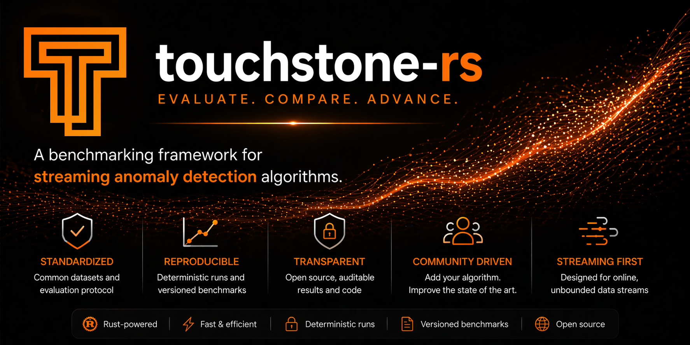

<p align="center">
  
</p>

[](https://crates.io/crates/touchstone-rs)

[](https://opensource.org/licenses/MIT)
[](https://deps.rs/crate/touchstone-rs/0.1.2)


# Touchstone-rs

Touchstone-rs is a Rust library for evaluating streaming anomaly detectors on labeled time-series benchmark datasets. Point it at a directory of CSVs, register one or more detectors, call `run()`, and get back a [Polars](https://pola.rs/) DataFrame with one row per `(dataset, detector)` pair.

Touchstone-rs is made in the spirit of [TimeEval](https://github.com/TimeEval/TimeEval) \[2\] — a Python benchmarking toolkit for time series anomaly detection algorithms. If you are looking for datasets, the TimeEval evaluation paper \[1\] provides a large collection already formatted for direct use with Touchstone-rs at the [TimeEval Datasets page](https://timeeval.github.io/evaluation-paper/notebooks/Datasets.html).

## Quickstart

Add to `Cargo.toml`:

```toml
[dependencies]
touchstone-rs = "0.1"
```

## Implementing the `Detector` Trait

Your algorithm must implement a single trait:

```rust
pub trait Detector: Send {
    fn name() -> &'static str where Self: Sized;
    fn new(n_dimensions: usize) -> Self where Self: Sized;
    fn update(&mut self, point: &[f32]) -> f32;
}
```

- `name()` returns the display name used in the results DataFrame and comparison tables.
- `point` is a slice of `f32` features for the current time step. The length matches the number of feature columns in the dataset.
- Return an **anomaly score** as `f32`. Higher values mean more anomalous.
- Return `f32::NAN` during warmup or whenever a score is not yet meaningful. NaN points are excluded from metric computation.
- Scores are **minmax-normalized** to `[0, 1]` before any metric is computed, so the absolute scale of your scores does not matter.

## Running an Evaluation

```rust,no_run
use std::path::Path;
use touchstone_rs::{Detector, Touchstone};

struct MyDetector { n_dimensions: usize }

impl Detector for MyDetector {
    fn name() -> &'static str { "MyDetector-v1" }

    fn new(n_dimensions: usize) -> Self {
        MyDetector { n_dimensions }
    }

    fn update(&mut self, point: &[f32]) -> f32 {
        // compute and return anomaly score
        0.5
    }
}

fn main() {
    let mut experiment = Touchstone::new(Path::new("data"));

    // `new(n_dimensions)` receives the dataset's feature count at runtime —
    // use it to size internal buffers to match.
    experiment.add_detector::<MyDetector>();

    let df = experiment.run().unwrap();
    println!("{df}");
}
```

## Output DataFrame

`run()` returns a DataFrame with this schema:

| column | type | description |
|---|---|---|
| `dataset` | String | dataset filename (without extension) |
| `detector` | String | name passed to `add_detector` |
| `roc_auc` | f64 | ROC-AUC |
| `pr_auc` | f64 | Precision-Recall AUC |
| `average_precision` | f64 | Average Precision |
| `precision` | f64 | Precision at 90th-percentile threshold |
| `recall` | f64 | Recall at 90th-percentile threshold |
| `f1` | f64 | F1 at 90th-percentile threshold |
| `range_precision` | f64 | Range-based Precision (Tatbul et al., NeurIPS 2018) |
| `range_recall` | f64 | Range-based Recall |
| `range_f_score` | f64 | Range-based F-score |
| `range_auc` | f64 | Range-based AUC |
| `range_pr_vus` | f64 | PR-VUS (Paparrizos et al., PVLDB 2022) |
| `range_roc_vus` | f64 | ROC-VUS |
| `time_sec` | f64 | wall-clock seconds for this detector on this dataset |

If a dataset fails to load or a detector produces only NaN scores, the metric columns for that row contain `NaN`.

## Custom Metrics

If the default metric set does not suit your needs, swap it out entirely by adding metrics before calling `run()`:

```rust,no_run
use std::path::Path;
use touchstone_rs::{Detector, Touchstone};
use touchstone_rs::metrics::{RocAuc, F1Score, SigmaThreshold};

# struct MyDetector { n_dims: usize }
# impl Detector for MyDetector { fn name() -> &'static str { "MyDetector" } fn new(n_dims: usize) -> Self { MyDetector { n_dims } } fn update(&mut self, _: &[f32]) -> f32 { 0.5 } }

let mut experiment = Touchstone::new(Path::new("data"));
experiment.add_detector::<MyDetector>();
experiment.add_metric(RocAuc);
experiment.add_metric(F1Score::new(SigmaThreshold(3.0)));
```

Implement `Metric` for fully custom scoring:

```rust
use touchstone_rs::metrics::Metric;

struct MyMetric;

impl Metric for MyMetric {
    fn name(&self) -> &str { "my_metric" }
    fn score(&self, labels: &[u8], scores: &[f32]) -> f64 {
        // labels: 0 = normal, 1 = anomaly
        // scores: minmax-normalized to [0, 1], NaN already removed
        todo!()
    }
}
```

## Dataset Format

Datasets are CSV files with no assumed column names:

```text
timestamp, feature_1, ..., feature_N, label
2016-04-20 10:35:12, 1.2, 3.4, 0
2016-04-20 10:35:13, 5.6, 7.8, 1
```

- **Column 1**: timestamp — parsed but ignored
- **Columns 2 … N**: features — cast to `f32`, passed as `point` to `update()`
- **Last column**: binary anomaly label — `0` (normal) or `1` (anomaly)

Touchstone-rs passes every row to `update()` in order, simulating a streaming environment. Each detector gets a fresh instance per dataset.

## Running the Built-in Example

```sh
cargo run --example normal_distribution_detector
```

This runs a rolling z-score detector (window = 20) against all datasets in `data/` and prints the results.

## Contributing an Algorithm

Touchstone-rs accepts new streaming anomaly detectors via pull request — each one lives as its own crate under `algorithms/` and is picked up automatically by the workspace. See [`ADD_ALGORITHM.md`](ADD_ALGORITHM.md) for the step-by-step workflow (fork → add crate → implement `Detector` → open PR) and how CI validates submissions.

## References

If you use Touchstone-rs or the TimeEval dataset collection in your work, please cite:

**\[1\] Dataset collection and evaluation methodology**
```bibtex
@article{SchmidlEtAl2022Anomaly,
  title = {Anomaly Detection in Time Series: A Comprehensive Evaluation},
  author = {Schmidl, Sebastian and Wenig, Phillip and Papenbrock, Thorsten},
  date = {2022},
  journaltitle = {Proceedings of the VLDB Endowment (PVLDB)},
  volume = {15},
  number = {9},
  pages = {1779--1797},
  doi = {10.14778/3538598.3538602}
}
```

**\[2\] TimeEval benchmarking toolkit**
```bibtex
@article{WenigEtAl2022TimeEval,
  title = {TimeEval: A Benchmarking Toolkit for Time Series Anomaly Detection Algorithms},
  author = {Wenig, Phillip and Schmidl, Sebastian and Papenbrock, Thorsten},
  date = {2022},
  journaltitle = {Proceedings of the VLDB Endowment (PVLDB)},
  volume = {15},
  number = {12},
  pages = {3678--3681},
  doi = {10.14778/3554821.3554873}
}
```

**\[3\] Touchstone-rs**
```bibtex
@software{TouchstoneRs,
  title = {Touchstone-rs: A Rust Library for Benchmarking Streaming Anomaly Detectors},
  author = {Wenig, Phillip},
  date = {2026},
  url = {https://github.com/wenig/touchstone-rs}
}
```
